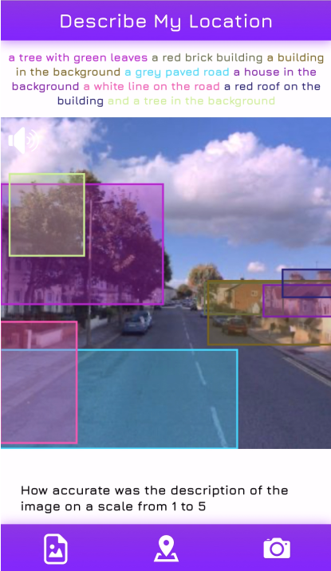
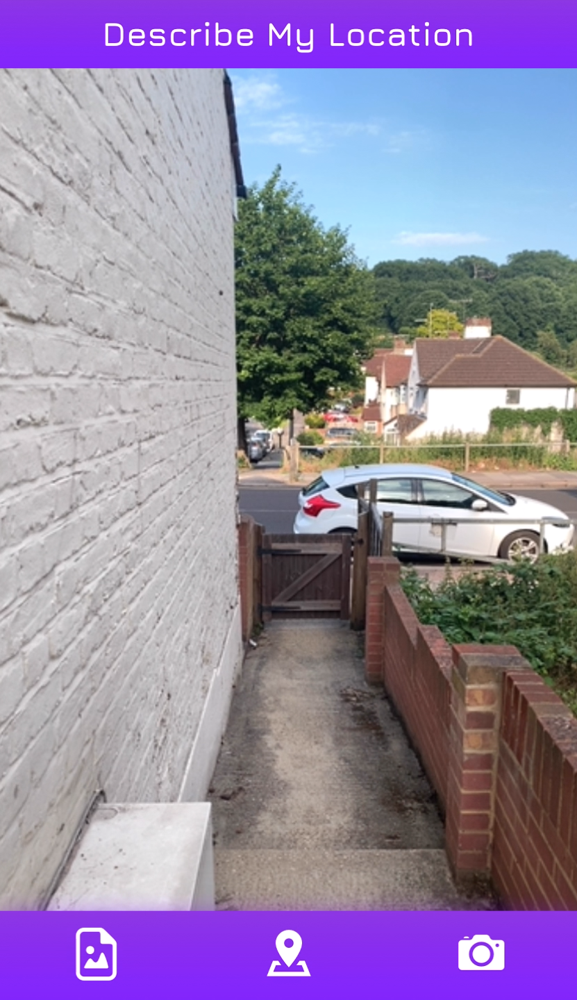
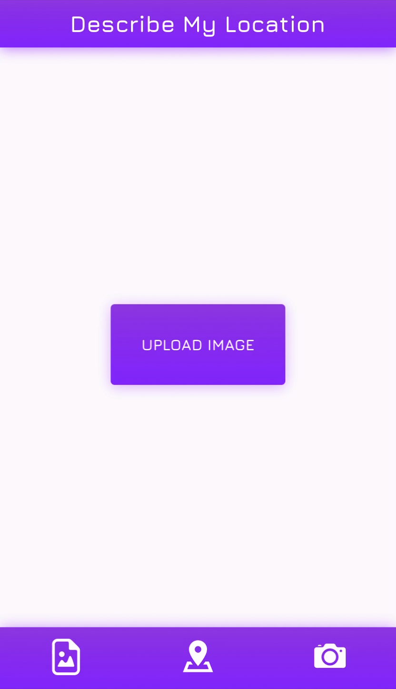
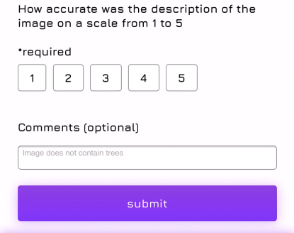

# Michael-Newcombe-Visual-Aid-Mobile-App-Describe-My-Location-

## A Mobile Web App For The Visually Impaired

## Overview

Describe My Location is a mobile web app developed using the web framework Flask. The app is designed to aid people who are visually impaired when they walking along a street, by describing their physical surroundings using a computer vision and machine learning technique called image captioning. This is where a computer tries to describe an image in a natural language. The difference between this app and other visual aid apps that make use of image captioning is that Describe My Location does not require the user to take a picture of their surroundings using their device's camera instead, it uses a street view image based on the user's current geographical location as a reference for the user's surroundings. The street view image is then passed into a pre-trained image captioning model which generates a text description for the image. The text description is then passed into a text to speech system so that the text can be outputted to the user as speech.

**Video demo:** https://vimeo.com/427505795

**Original repo:** https://gitlab.doc.gold.ac.uk/mnewc002/computer-vision-and-machine-learning

**Blog:** https://www.tumblr.com/blog/michaelnewcombe

## App Specifications

**Image Captioning**

The app uses by a pre-train machine learning model called DenseCap which is developed in Lua using the framework Torch. DenseCap is used for image captioning and works by generating text descriptions for the different objects it detects within an image which is referred to as dense captioning. This is different from how standard image captioning models work as they instead try to do describe an image in one sentence. The paper regarding the model DenseCap and the term dense captioning can be found, [here](https://cs.stanford.edu/people/karpathy/densecap/).
 
**Street View Images**

The street view images the app uses as a reference for the user's surroundings is, based on the user's current location this works, by retrieving the device's geolocation coordinates. As well as the user's location, the direction that the user is facing is also retrieved, by accessing the device's orientation properties. This data is, then passed into the Bing™ Maps REST Services API which is, used to download the street view image for the user's current location. Documentation on this API can be found, [here](https://docs.microsoft.com/en-us/bingmaps/rest-services/).




**Camera**

In situations where the app is unable to retrieve a street view image for the user's current location, the user can instead take a picture of their surroundings using their device's camera. 



**File upload**

The app also gives the user the option to get descriptions for images saved on their device using the file upload feature. The file upload feature also allows users to upload an image using their device's camera.



**User Feeback**

Users can also leave feedback on how accurate the descriptions generated by the app for a given image were. This information is, then stored in a MySQL database. 



## Setup

**Prerequisites:**

Required: DenseCap, Python 3, Flask 1.1.1, flask-wtf, pyOpenSSL, wtforms, NumPy

Optional: MySQL, PyMySQL

**Important!**

To simplify the setup, I have disabled the user feedback feature as this requires a MySQL database. If you would like to run this feature, you must first set the value of the variable ```connect_to_db``` to ```true``` this can be found on ```line 50``` inside ```app.py```. You will then have to download and setup [MySQL](https://dev.mysql.com/downloads/mysql/), create a database called ```describe_my_location``` then create a table called ```images``` using the ```image-table.sql``` file.

**Step 1:** Download [DenseCap](https://github.com/jcjohnson/densecap) and follow the ```Installation```, ```Pretrained model```, and ```Running on new images``` steps, furthermore make sure the root directory name is ```densecap```. If you encounter the error, ```Wrong JPEG library version``` when running the model this is because DenseCap requires an older version of a library called ```libjpeg``` specifically ```version 80```. If you are on macOS download the package manager Homebrew then from inside a terminal type the command ```brew edit libjpeg```, this will open the ```libjpeg formula file``` in a terminal text editor such as Vim. Then to install libjpeg version 80 through homebrew I have supplied an edited formula file that can be downloaded [here](https://drive.google.com/file/d/1zYSrmgdl06eJ-QMEmX5ATTbruTV8B8iL/view?usp=sharing). Next, replace the content inside the original ```libjpeg formula file``` with the content inside ```libjpeg80.txt```. 

**Step 2:** Create a virtual environment for Python 3, this will be used to store Flask and the additional Python packages. I am using [conda](https://docs.conda.io/projects/conda/en/latest/user-guide/tasks/manage-environments.html) as my virtual environment however you can use any virtual environment you wish.

**Step 3:** From within your virtual environment download and install [Flask](https://flask.palletsprojects.com/en/1.1.x/installation/), along with the following additional libraries, [flask-wtf](https://flask-wtf.readthedocs.io/en/stable/install.html), [pyOpenSSL](https://www.pyopenssl.org/en/stable/install.html), [wtforms](https://pypi.org/project/WTForms/), and [NumPy](https://numpy.org/install/).

**Step 4:** Clone or download this repository, then place the entire ```densecap``` directory into the ```Flask``` directory.

**Step 5:** From within a terminal ```cd``` into the directory containing the file ```app.py```, then type the following commands: 

```
export FLASK_APP=app.py
flask run --cert=adhoc --host=0.0.0.0
```

This will run the app as well as make the app publicly available from within your network

**Step 6:** To test the app on a mobile device, make sure the mobile device and your computer are connected to the same network. Then on the mobile device open up a browser and type the URL ```https:// IP address of your computer :5000/```. 

The app has been tested on an iPhone XR and works on the following browsers for iOS, Google Chrome, Safari, Firefox, and Opera touch. However please note that the camera feature only works on Safari this is because Apple does not allow third-party browsers access to the iPhone camera. However, you can still take pictures through your device's camera using the file upload feature. The app has not yet been tested on Android devices however it should work as long as your device is running an up to date version of Android.    
